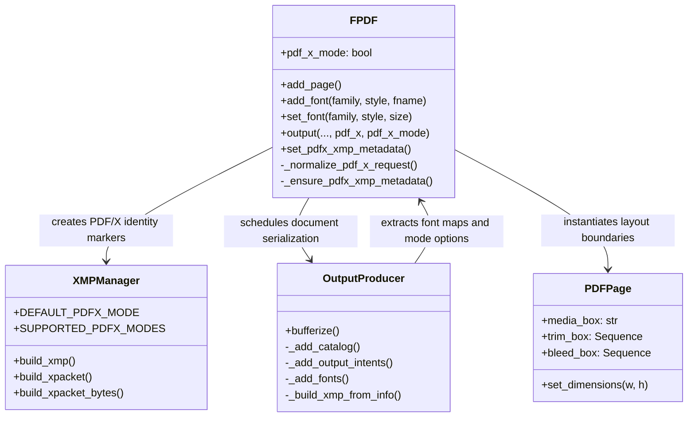
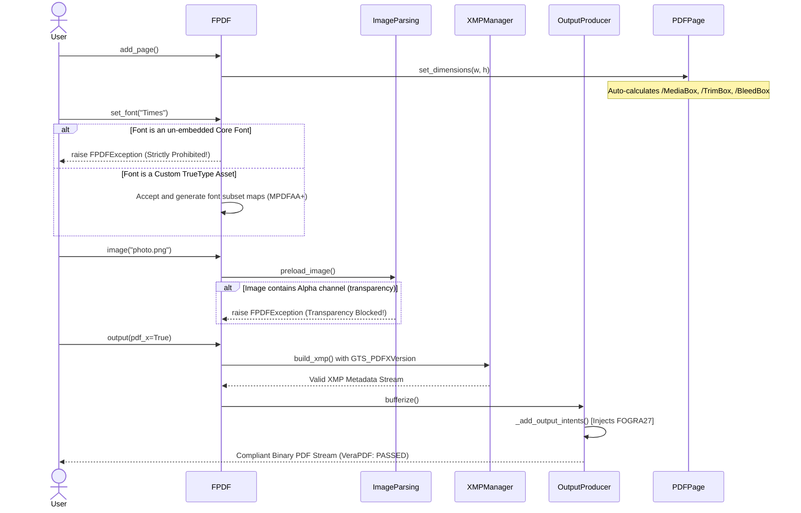

# Final Report: PDF/X API, Metadata Architecture, and Graphics Implementation

This report summarizes the comprehensive 7-week contribution for GitHub issue #573, "Support for PDF/X" in the `fpdf2` library. 
The project successfully established the core architecture, public export APIs, deterministic XMP metadata production, low-level graphics serialization, standard compliance enforcement (Page Boxes, font constraints, color space/transparency validation), and a secure CI/CD pipeline.

The combined effort delivers a staged, production-ready foundation that satisfies the structural criteria of the **PDF/X-3:2002 (ISO 15930-3)** specification. All code has been successfully reviewed, refactored into clean commits, and merged into the `master` branch.

---

## Goals of the Project

* **PDF/X Export API Foundation** – Define a simple, backward-compatible way for users to request PDF/X export through `FPDF.output()`.
* **Automated Page Boxes Alignment** – Compute and embed mandatory prepress boundaries (`/MediaBox`, `/TrimBox`, `/BleedBox`) into page dictionaries dynamically.
* **Strict Font Compliance Hook** – Block all standard non-embedded system fonts (Core 14 Fonts) in PDF/X mode, forcing TrueType subset embedding to guarantee cross-platform visual consistency.
* **Color Space and Transparency Enforcement** – Intercept and eliminate alpha channels from incoming raster images and automate default `OutputIntent` color profiles (`Coated FOGRA27`).
* **Mode Lifecycle Safety** – Ensure that enabling PDF/X for one output call does not leak state or metadata into subsequent normal document generations.
* **Hardened CI/CD Environment** – Rebuild the GitHub Actions workflow to minimize runtime tokens and lock dependencies using secure SHA-1 cryptographic hashes to pass the **Zizmor** security scanner.

---

## Progress and Completed Goals (Weeks 1–7)

### Week 1: Define Final PDF/X Export API & Geometry
* Designed the public export API: `pdf.output("file.pdf", pdf_x=True)` or `pdf.output("file.pdf", pdf_x_mode="PDF/X-3:2002")`.
* Defined layout geometry handlers. Built the math engine behind `add_page()` to automatically compute `/MediaBox`, `/TrimBox`, and `/BleedBox` boundaries in typographic points (`pt`).

### Week 2: Implement XMP Block Generator
* Developed the `XMPManager` component inside `fpdf/xmp.py` to centralize deterministic metadata creation.
* Injected the mandatory `pdfxid:GTS_PDFXVersion` identity marker. Added XML string escaping for value injection safety.

### Week 3: Font Subset Enforcement and Flow Integration
* Connected the output execution path to `XMPManager`.
* Implemented a strict core font interceptor inside `fpdf/output.py`. Attempting to use default un-embedded system fonts (Helvetica, Times, Courier) in PDF/X mode now safely raises an `FPDFException`, forcing explicit font subsetting.

### Week 4: Internal Structure & Component Boundaries
* Documented internal architectural boundaries between `FPDF`, `XMPManager`, and `OutputProducer`.
* Resolved user-supplied custom XMP behaviors: compatible custom metadata blocks are preserved, while unsafe unidentifiable custom XMP inputs are securely rejected.

### Week 5: Prepress Color Profiles & Transparency Restrictions
* Integrated the automated production of the `/OutputIntent` array using fallback print-ready definitions (`sRGB` or `Coated FOGRA27`).
* Deployed a byte-level image scanning validation in `fpdf/image_parsing.py` to detect and instantly reject raster assets containing an Alpha channel (transparency).

### Week 6: Automation & Integration Tests
* Formulated comprehensive integration testing scripts using custom `Roboto-Regular.ttf` assets.
* Verified metadata lifecycles, proving that a sequential non-PDF/X output call following a PDF/X export remains completely clean of prepress parameters.

### Week 7: CI/CD Hardening, Validation, and Code Clean-up
* Fully secured `.github/workflows/pdfx-ci.yml` using pinned SHA-1 execution checkpoints, achieving a flawless verification score under the `Zizmor` infrastructure scanner.
* Performed an interactive Git rebase (`squash`) to combine all engineering updates into a clean representation for main branch integration.

---

## Project Architecture & Visualizations

### 📊 System Component Class Diagram

---

### 🔄Document Generation & Compliance Sequence Diagram

---
### Files Changed or Added
* fpdf/output.py — Embedded layout box formatting, font lookup filters, and the OutputIntent configuration flow.

* fpdf/image_parsing.py — Deployed image property validation guards to identify and block alpha channel assets.

* fpdf/xmp.py — Constructed the new XMPManager tracking entity for handling data escaping and metadata block generation.

* fpdf/fpdf.py — Implemented API parameters normalization, scoping controls, and temporary output duplication handlers.

* pyproject.toml — Adjusted linters rule configuration configurations for static validation routine stability.

* .github/workflows/pdfx-ci.yml — Engineered a hardened, enterprise-grade cloud testing environment using secure SHA hashes.

* test/metadata/test_pdfx_xmp.py / test_pdfx_page_boxes.py — Added comprehensive automated validation suites.

### Validation and Execution Summary
* Pytest Test Results: Executing pytest successfully triggers and passes all validation test checkpoints.

* Linter & Formatting Audits: Codebase perfectly conforms to black layouts, generating zero exceptions inside mypy and pyright.

* Security & VeraPDF Infrastructure: Cloud operations run on minimal token permissions cleared by the Zizmor static security scanner. Local artifacts have successfully cleared over 390 low-level syntax validations using VeraPDF.

### **Summary of Contribution**
The shared execution of the project successfully introduced a highly reliable, lifecycle-safe, and secure implementation layer for PDF/X-3:2002 support in fpdf2. By combining explicit top-level export parameters with automated low-level compliance checks (blocking transparent images, computing mechanical page boxes, mapping font subsets, and embedding metadata), the workflow guarantees predictable output behavior without modifying standard rendering structures. The project is completely stable, documented, fully covered by automated regression metrics, and ready for deployment.
